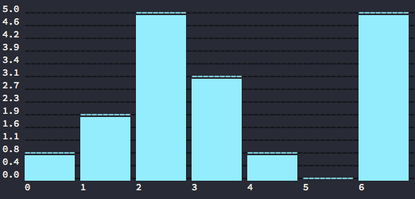

comrate [](https://travis-ci.org/mrzmyr/comrate)
=========

> Add a rating to your commits



## Install

```
npm install -g comrate
```

## Usage

```
❯ comrate

Usage: comrate [options] [command]

Commands:

  stats|s [options]   Show stats for git repository
  enable [options]    Enable fun rating for current directory
  disable [options]   Disable fun rating for current directory

Options:

  -h, --help             output usage information
  -V, --version          output the version number
  -d, --dir [directory]  Git repository directory
  -v, --verbose          Log verbose
```

### Enable

```
cd ~/projects/my-fun-project

❯ comrate enable

Info: comrate is already enabled
```

### Commit

```
❯ git commit -m "my fun commit"
? What fun rating would you give for this commit? (Use arrow keys)
  0
  1
  2
❯ 3
  4
  5
```

### Stats

```
cd ~/projects/my-fun-project

comrate stats
```

### Commit Message

The rating will be [encrypted appended](src/util.js#L12) to the commit message to save it for the stats.

```
commit f8decb223252e2dc0a0e043ad5d81509d8830534
Author: username <email@example.com>
Date:   Tue Mar 21 11:04:48 2015 +1100

    my fun commit

    FRCNQo=tBvse9U=
```
